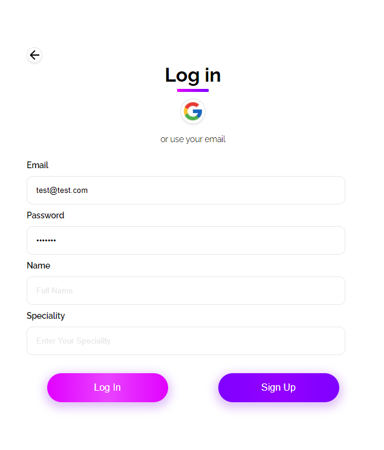
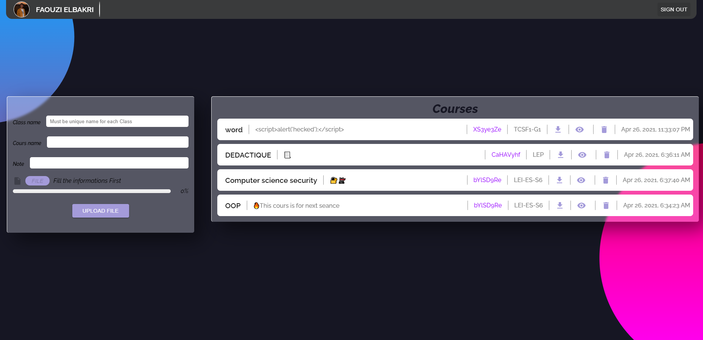
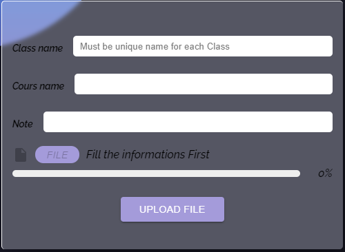
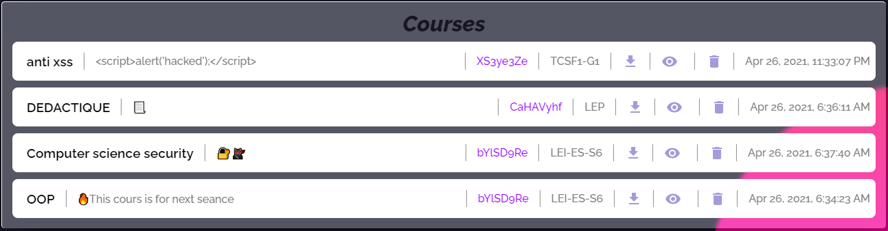

# ProStudent

due to covid and all the world journey from the old way of stuying and sharing courses and files between teachers and students to more of a digital approch of teaching and sharing files i created this is web app for a much easier files sharing between teachers and student with just one code you get from your teacher you can access all of your courses

## First page

remember that you can always press the name of ProStudent to go back to the initial stage of the page

Contains a simple ui to get started using the app without knowing too much about the concept

- first you shoose wiether you are a student or a teacher
- then depends on your first choice you either get the teacher page or the student page
  lets start with the simplest one

## Student page

contains two magur elements

- the first one is an input field that listen in real time for any code typed in it and tries to get the corresponded cours linked to the code
- the second is a place where the corresponded courses shows if there's any
  note : if there is a hidden cours you'll get a message at the bottom indecating that so you have the choice to ask your teacher to unhide it
- finally you can download the file attached to course using the download button on each course line

## Authentication page

Before accessing the teacher page you should see a login form that contains two options either with google authentication or with Email and password

### Login form

if you have already created an account then just typing your password and email will be enough or using google icon for the google authentication

### sign up form

but if you have no account you will have to type an email and password then press the sign up button to bring two more field (as shown below) to fill before creating your account

## Teacher page

after the authetication (in my case using google's) you get redericted tothe teacher page which contains two element

### Add courses form

this part here is for adding courses by specifying the class name that you want to access the file (_**should be always the same in order for the courses to keep grouping with other old courses of the same class**_) and also the name should be **UNIQUE** for each class as it is the element that responsible for the generated code changing it will change the random code

- class name and cours name are _required_ as for the note it's optional

### Courses Layout

each course is structured in one line with the following informations:

- the date that was created in
- the button for all the possible actions :
  1.  delete
  2.  hide the course from students
  3.  download the file
- the class name which will be getting the course
- the auto generated code to share with the students in order for them to get the course
- then the remark added if there's a remark
- finally the course name
