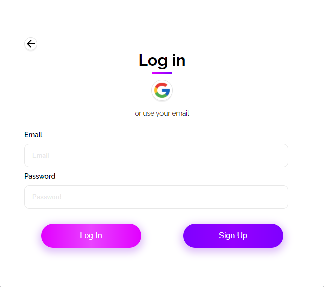

# ProStudent

due to covid and all the world journey from the old way of stuying and sharing courses and files between teachers and students to more of a digital approch of teaching and sharing files i created this is web app for a much easier files sharing between teachers and student with just one code you get from your teacher you can access all of your courses

## First page

Contains a simple ui to get started using the app without knowing too much about the concept

- first you shoose wiether you are a student or a teacher
- then depends on your first choice you either get the teacher page or the student page
  lets start with the simplest one

## Student page

contains two magur elements

- the first one is an input field that listen in real time for any code typed in it and tries to get the corresponded cours linked to the code
- the second is a place where the corresponded courses shows if there's any
  note : if there is a hidden cours you'll get a message at the bottom indecating that so you have the choice to ask your teacher to unhide it

## Teacher page

Before accessing the teacher page you should see a login form that contains two options either with google authentication or with Email and password

### Login form

